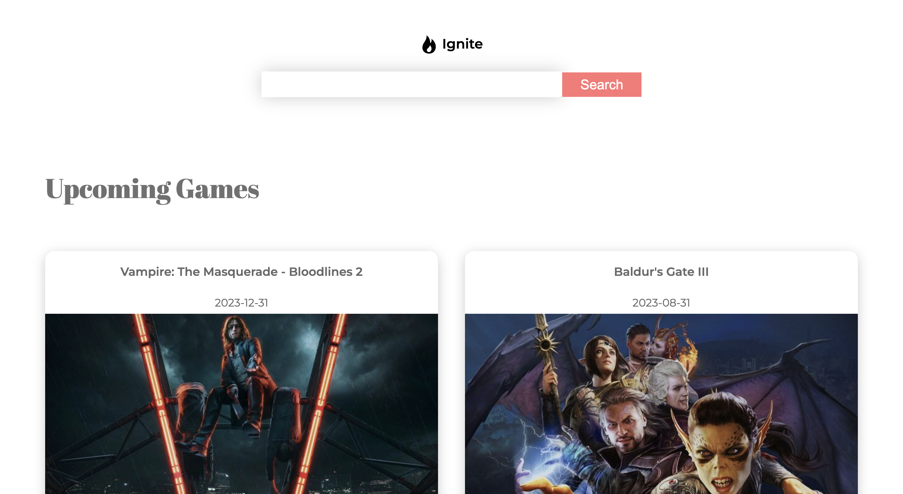
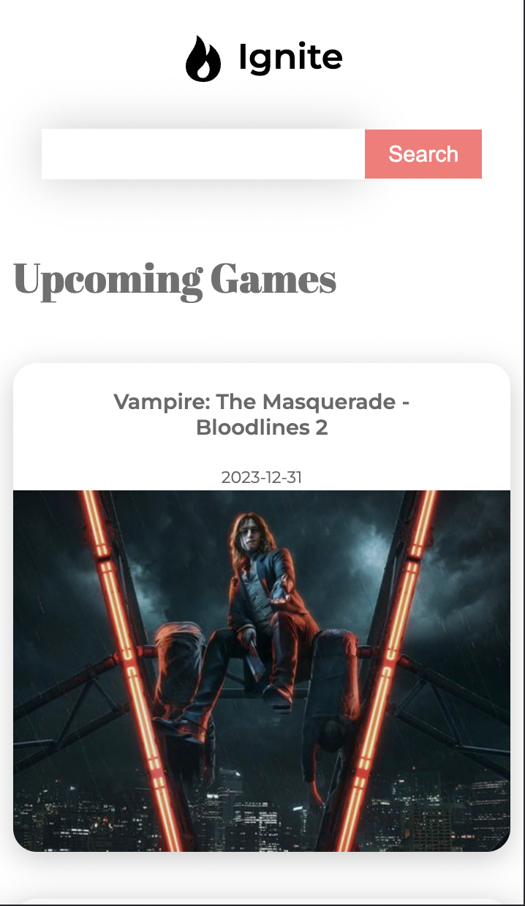
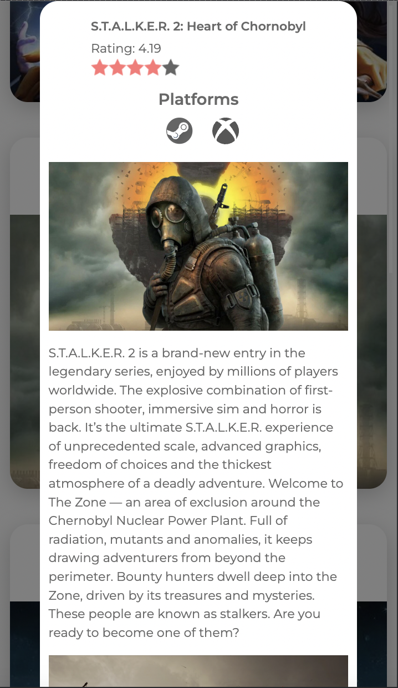
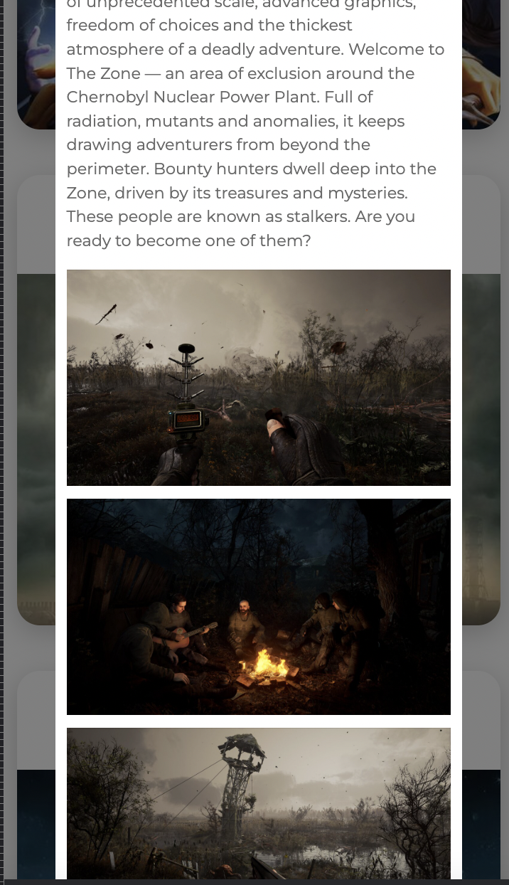

# Ignite

## Description

Ignite is a game search and detail application built using React. It utilizes the RAWG Video Games Database API to fetch game data and provide users with information about different games. The application features a single-page design with a search bar in the navigation, smooth animations for rendering game cards, and detailed information about individual games.

## Components

The Ignite application consists of the following components:

- **Game**: This component is responsible for displaying a game card with basic information such as the title, release date, and platform.

- **GameDetails**: This component renders detailed information about a selected game, including its description, screenshots, and ratings.

- **Navbar**: This component contains the navigation bar with a search bar for searching games.

## Technologies Used

The following technologies were used in the development of the Ignite application:

- React: A JavaScript library for building user interfaces.

- React Router DOM: Provides declarative routing for React applications.

- Redux: A predictable state container for JavaScript apps.

- Redux Thunk: A middleware that allows writing action creators that return a function instead of an action.

- Framer Motion: A library for creating fluid animations in React.

- Styled Components: A CSS-in-JS library for styling React components.

- Axios: A promise-based HTTP client for making API requests.

## Installation and Setup

To run the Ignite application locally, follow these steps:

1. Clone the repository:

git clone https://github.com/your-username/ignite.git

2. Navigate to the project directory:

cd ignite

3. Install the dependencies:

npm install

4. Start the application:

npm start

5. Open your browser and visit [http://localhost:3000](http://localhost:3000) to access the Ignite application.

## Contributing

Contributions to the Ignite application are welcome. If you find any issues or have suggestions for improvements, please feel free to open an issue or submit a pull request.

When contributing to this repository, please ensure that your pull requests follow the established code style and include relevant tests.

## License

The Ignite application is open-source software licensed under the [MIT License](https://opensource.org/licenses/MIT).

## Acknowledgments

- The Ignite application was developed as part of a React web development course.
- The RAWG Video Games Database API was used to fetch game data.

---

Thank you for using Ignite! If you have any questions or need further assistance, please don't hesitate to reach out.
